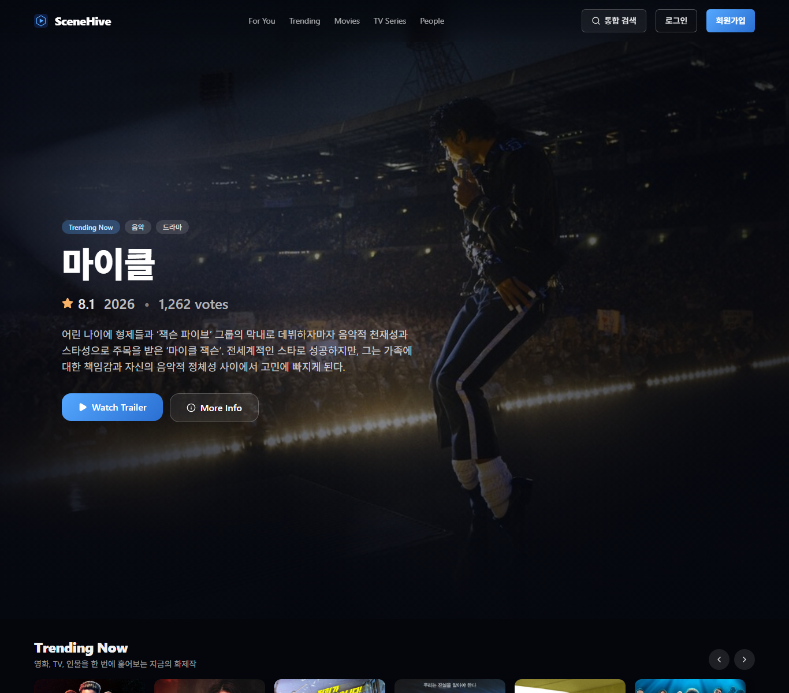
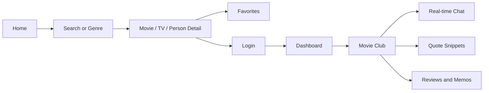
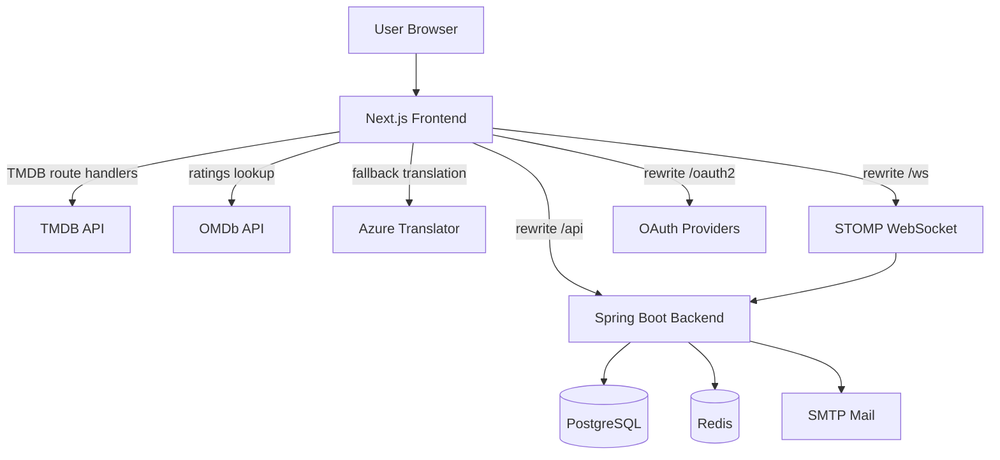
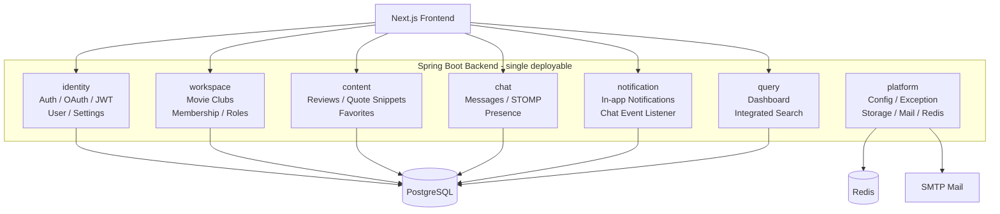
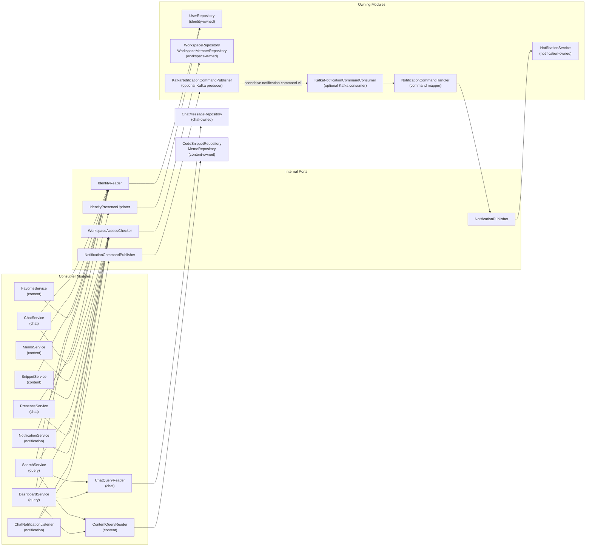
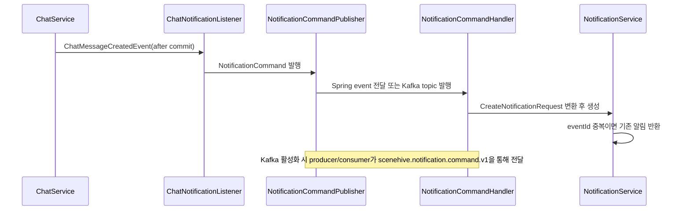
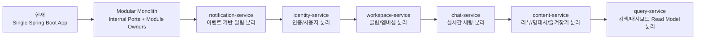
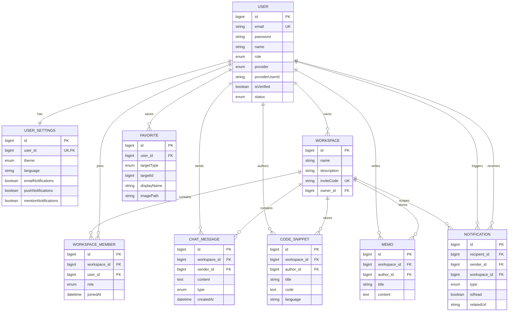

# SceneHive

영화 팬을 위한 커뮤니티 플랫폼입니다.  
사용자는 TMDB 기반으로 영화·TV·인물을 탐색하고, 영화 클럽에 참여해 실시간으로 대화하며, 명대사와 리뷰를 축적할 수 있습니다.

http://158.180.74.119/



## 한눈에 보는 프로젝트

**SceneHive**는 기존 협업형 커뮤니티 구조를 영화 도메인에 맞게 재해석한 서비스입니다.

- 영화 클럽(Workspace) 기반 커뮤니티
- 실시간 토론 채팅과 멘션 알림
- 명대사 아카이브와 리뷰/감상문 작성
- 영화/TV/인물 통합 탐색, Discover 필터, 상세 정보 조회
- OTT 제공처, 한국 극장 상영 여부, 예매처 이동, 외부 평점 지표
- 즐겨찾기, 관심 장르, 최근 본 흐름 기반 개인 큐레이션
- JWT + OAuth2 기반 인증 시스템

현재 활성 프론트엔드는 [`frontend-next/`](./frontend-next)이며, 프로젝트는 Next.js 기반 구조를 중심으로 유지되고 있습니다.

## 서비스 맵

| 영역 | 주요 기능 | 사용자 가치 |
|------|----------|------------|
| **Explore** | Home Trending, Search, Discover Filters, Movie/TV/People Detail | 영화·TV·인물을 한 흐름에서 찾고 비교합니다. |
| **Watch** | Watch Providers, External Ratings, Theater Booking Links | 어디서 볼 수 있는지, 평점은 어떤지, 극장 예매는 어디서 할지 바로 확인합니다. |
| **Community** | Movie Clubs, Real-time Chat, Mentions, Notifications | 관심 작품을 중심으로 모이고 실시간으로 대화합니다. |
| **Archive** | Quote Snippets, Reviews and Memos, Workspace Search | 명대사와 감상 기록을 쌓고 클럽 안에서 다시 찾아봅니다. |
| **Account** | JWT Auth, Email Verification, Password Reset, OAuth2 Login | 안전하게 로그인하고 개인화된 탐색 경험을 이어갑니다. |

## 프로젝트 컨셉

SceneHive는 단순한 영화 정보 조회 사이트가 아니라, 영화를 매개로 사람들이 모이고 기록을 남기는 커뮤니티를 지향합니다.

- `영화 클럽`: 특정 영화, 시리즈, 감독, 장르를 주제로 운영하는 커뮤니티 공간
- `실시간 토론`: 클럽 멤버 간 빠른 감상 공유와 대화
- `명대사 아카이브`: 기억에 남는 장면과 대사를 저장하는 스니펫 공간
- `리뷰 & 감상문`: 마크다운 기반 장문 리뷰와 정리 노트
- `탐색 경험`: 홈 트렌딩, Discover 필터, 검색, 상세 페이지로 이어지는 영화/TV/인물 탐색 흐름

## 사용자 흐름



## 현재 구현 범위

### 사용자 경험

- SceneHive 브랜딩 기반 `Dark Cinema` UI
- 홈에서 트렌딩 영화, TV, 인물 탐색
- 영화/TV/인물 통합 검색
- 영화/TV/인물 상세 페이지
- `/discover` 기반 영화/TV 통합 탐색, 장르·연도·평점·정렬 필터
- 기존 `/genres/[genreId]`는 Discover 조건 진입점으로 리다이렉트
- 로그인 사용자 전용 즐겨찾기 토글 및 대시보드 표시
- 관심 장르 온보딩 및 최근 본 콘텐츠 흐름 기반 홈 추천
- TMDB 한국어 데이터가 부족한 경우 영어 원문 fallback 후 Azure Translator 기반 한국어 번역
- 홈/상세 이미지 로딩 최적화 및 상세 페이지 progressive loading

### 커뮤니티 기능

- 영화 클럽 생성, 조회, 참여, 멤버 관리
- 실시간 채팅 및 REST 기반 메시지 조회
- 명대사 스니펫 CRUD
- 리뷰/감상문 메모 CRUD 및 검색
- 워크스페이스 단위 통합 검색
- 알림 목록, 읽음 처리, 읽지 않음 개수 조회

### 인증 및 계정

- 이메일 회원가입 / 로그인
- JWT Access Token + Refresh Token Cookie
- 이메일 인증
- 비밀번호 재설정
- 계정 잠금 해제
- OAuth2 로그인
  - Google
  - Kakao
  - Naver

### 콘텐츠 상세 정보

- 영화/TV 상세 기본 정보, 장르, 출연진, 제작 정보, 트레일러
- 추천/유사 콘텐츠 fallback 체인
- OTT 제공처 정보 표시
- 영화 상세 한정 한국 극장 상영중 여부 표시
- CGV, 롯데시네마, 메가박스 예매처 이동 카드
- OMDb 기반 외부 평점 지표
  - Rotten Tomatoes Tomatometer
  - Metascore
  - IMDb 사용자 평점

## 최근 고도화 요약

- 홈 구성을 영화 중심에서 영화·TV·인물 혼합 탐색 구조로 확장했습니다.
- `/discover`를 추가해 기존 장르 페이지보다 넓은 조건 탐색 흐름을 제공합니다.
- 상세 페이지는 초기 렌더링에 필요한 primary 데이터와 후속 supplemental/translation 데이터를 분리해 첫 로딩 체감을 줄였습니다.
- TMDB 이미지 요청은 OCI 환경의 첫 이미지 변환 병목을 줄이기 위해 직접 로딩 중심으로 정리했습니다.
- OMDb API 연동으로 Rotten Tomatoes, Metascore, IMDb 점수를 표시하고, 점수 카드 UI를 다크 글라스 스타일로 정리했습니다.
- Watch Providers 섹션에서 OTT 정보와 한국 극장 상영 여부를 함께 보여주고, 상영중 영화는 주요 멀티플렉스 예매처로 이동할 수 있게 했습니다.
- 예매처 로고는 흰 배경이 뜨지 않도록 로컬 투명 자산으로 고정했습니다.
- CI/CD는 변경 파일을 감지해 프론트엔드/백엔드를 선택적으로 빌드·배포하는 구조로 단순화했습니다.

## 핵심 화면 흐름

1. 사용자는 `/home`에서 현재 화제작과 추천 탐색을 시작합니다.
2. 검색 또는 장르 탐색으로 관심 작품을 찾습니다.
3. 상세 페이지에서 작품 정보를 확인하고 즐겨찾기에 저장합니다.
4. 로그인 후 대시보드와 영화 클럽에서 토론, 명대사 저장, 리뷰 작성을 이어갑니다.

## 기술 스택

### Backend

- Java 17
- Spring Boot 3.2.1
- Spring Security 6
- Spring Data JPA
- Spring WebSocket + STOMP
- Spring Mail
- PostgreSQL
- Redis
- JJWT 0.12.3
- Lombok

### Frontend

- Next.js 14 App Router
- React 18
- TypeScript 5
- TanStack Query 5
- Axios
- Tailwind CSS
- Radix UI / shadcn 스타일 컴포넌트
- SockJS + STOMP.js
- react-markdown
- TMDB API v3
- OMDb API
- Azure AI Translator

### Infrastructure

- Docker Compose
- Next.js Standalone
- PostgreSQL 15
- Redis
- GitHub Actions
- GitHub Container Registry

## 아키텍처 개요

SceneHive는 현재 하나의 Spring Boot 백엔드로 배포되지만, 내부 구조는 MSA 전환을 염두에 둔 **모듈러 모놀리스** 방향으로 정리 중입니다.
운영 관점에서는 단일 애플리케이션이고 개발 관점에서는 `identity`, `workspace`, `content`, `chat`, `notification`, `query`, `platform` 경계를 기준으로 책임을 나눕니다.



프론트엔드는 `next.config.mjs`의 rewrite 설정을 통해 백엔드 API, WebSocket, OAuth 경로를 프록시합니다.  
TMDB 기반 영화 데이터는 `frontend-next/src/app/api/**` 및 `frontend-next/src/lib/tmdb.ts`를 통해 처리합니다.

## 백엔드 모듈러 모놀리스 구조

### 내부 모듈 맵



### 모듈 책임과 주요 코드 위치

| 모듈 | 책임 | 주요 위치 |
|------|------|----------|
| `identity` | 인증, OAuth2, JWT, 사용자, 프로필, 설정 | `identity/`, `security/`, `AuthService`, `UserService`, `UserSettingsService` |
| `workspace` | 영화 클럽, 멤버십, 초대코드, 역할 권한 | `workspace/`, `WorkspaceService`, `Workspace*` entity/repository |
| `content` | 명대사 스니펫, 리뷰/감상문, 즐겨찾기 | `SnippetService`, `MemoService`, `FavoriteService` |
| `chat` | 채팅 메시지, STOMP, 접속 상태, 채팅 이벤트 | `ChatService`, `ChatPresenceTracker`, `PresenceService`, `ChatMessageCreatedEvent` |
| `notification` | 알림 생성, WebSocket 알림 전송, 채팅 알림 리스너 | `notification/`, `NotificationService`, `ChatNotificationListener` |
| `query` | 대시보드 집계, 워크스페이스 통합 검색 | `DashboardService`, `SearchService` |
| `platform` | 공통 설정, 예외 처리, 파일 저장, Redis, 메일 | `config/`, `exception/`, `FileStorageService`, `RedisService`, `service/mail/` |

### 의존성 방향

핵심 규칙은 **다른 모듈의 Repository를 직접 가져다 쓰지 않고, 작은 내부 포트 인터페이스를 통해 접근하는 것**입니다.



### 현재 적용된 내부 포트

| 포트 | 구현체 | 목적 |
|------|--------|------|
| `IdentityReader` | `PersistenceIdentityReader` | 이메일/id 기반 사용자 조회 책임을 identity 모듈 뒤로 숨김 |
| `IdentityPresenceUpdater` | `PersistenceIdentityPresenceUpdater` | WebSocket 접속 상태 변경을 identity 모듈의 사용자 상태 쓰기로 격리 |
| `WorkspaceAccessChecker` | `PersistenceWorkspaceAccessChecker` | 워크스페이스 조회, 멤버십 확인, 관리자/소유자 권한 판단을 workspace 모듈로 집중 |
| `NotificationCommandPublisher` | `SpringNotificationCommandPublisher` / `KafkaNotificationCommandPublisher` | 기본은 Spring event fallback, `KAFKA_NOTIFICATIONS_ENABLED=true`일 때 Kafka command topic으로 발행 |
| `NotificationPublisher` | `NotificationServicePublisher` | command handler가 `NotificationService`에 직접 묶이지 않고 알림 발행만 요청 |
| `ChatQueryReader` | `PersistenceChatQueryReader` | 대시보드/검색이 채팅 저장소를 직접 읽지 않고 chat 모듈 read port를 사용 |
| `ContentQueryReader` | `PersistenceContentQueryReader` | 대시보드/검색이 명대사/리뷰 저장소를 직접 읽지 않고 content 모듈 read port를 사용 |

### Notification 분리 준비 흐름



`NotificationCommand`는 `notification.contract` 패키지에 두고 `eventId`, `schemaVersion`, `occurredAt`을 포함합니다. 이 계약 패키지는 애플리케이션 DTO/entity/repository/service를 import하지 않도록 아키텍처 테스트로 보호하며, Kafka command topic은 `scenehive.notification.command.v1`입니다.
`eventId`는 `notifications.event_id`에 저장되며, 같은 command가 다시 처리되어도 알림을 중복 생성하지 않는 멱등성 기준으로 사용합니다.
Kafka topic, retry, DLQ, idempotency 정책은 [`docs/architecture/notification-kafka-policy.md`](./docs/architecture/notification-kafka-policy.md)에 별도로 고정합니다.
Kafka broker는 optional profile로 실행되며, 애플리케이션 전환은 `KAFKA_NOTIFICATIONS_ENABLED=true`로 제어합니다. 필요 시 `docker compose --profile kafka up -d kafka kafka-init`로 topic까지 준비합니다.

### MSA 전환 예상 흐름



더 상세한 경계 규칙과 리팩터링 체크포인트는 [`docs/architecture/modular-monolith.md`](./docs/architecture/modular-monolith.md)에 정리되어 있습니다.

## 데이터 모델링

README에는 빠른 이해를 위한 상위 수준 데이터 모델만 싣고, 상세 컬럼/DDL은 실제 엔티티와 스키마 설정을 기준으로 관리하는 것이 일반적입니다.  
현재 SceneHive는 아래와 같은 도메인 모델을 중심으로 동작합니다.



### 핵심 모델 설명

| 엔티티 | 역할 | 핵심 포인트 |
|------|------|------|
| `users` | 계정, 인증, 프로필의 중심 | 로컬/소셜 로그인 provider 정보를 함께 보관 |
| `user_settings` | 사용자 환경설정 | `users`와 1:1 관계 |
| `workspaces` | 영화 클럽 단위 공간 | 소유자(`owner_id`)와 초대코드 기반 참여 구조 |
| `workspace_members` | 클럽 멤버십 | `workspace_id + user_id` 유니크 제약으로 중복 가입 방지 |
| `chat_messages` | 실시간 토론 기록 | 워크스페이스와 발신자 기준으로 누적 |
| `code_snippets` | 명대사/스니펫 아카이브 | 워크스페이스별 기록, 작성자 추적 |
| `memos` | 리뷰/감상문 | 마크다운 기반 장문 콘텐츠 저장 |
| `notifications` | 멘션/활동 알림 | recipient 중심 읽음 상태 관리, 인덱스 존재 |
| `favorites` | 영화/TV/인물 즐겨찾기 | 로컬 작품 테이블 없이 `targetType + targetId`로 TMDB 대상을 참조 |

### 설계 포인트

- 영화/TV/인물 원천 데이터는 TMDB에서 조회하고, 로컬 DB에는 전체 카탈로그를 저장하지 않습니다.
- 즐겨찾기는 내부 FK 대신 `targetType`, `targetId` 조합으로 외부 콘텐츠를 식별합니다.
- 커뮤니티 데이터는 `workspace`를 중심으로 채팅, 메모, 스니펫, 알림이 연결되는 구조입니다.
- 멤버십은 `workspace_members` 조인 엔티티로 분리해 권한(`OWNER`, `ADMIN`, `MEMBER`)을 표현합니다.
- 알림은 `recipient_id`, `is_read`, `created_at` 복합 인덱스로 읽지 않은 항목 조회를 최적화합니다.

## 디렉터리 구조

```text
.
├── src/main/java/com/example/auth/   # Spring Boot 백엔드
│   ├── config/                       # Security, WebSocket, Async, Storage 설정
│   ├── controller/                   # 인증, 사용자, 워크스페이스, 채팅, 메모, 스니펫, 즐겨찾기 API
│   ├── identity/                     # identity 모듈 내부 포트/어댑터
│   ├── workspace/                    # workspace 모듈 내부 포트/어댑터
│   ├── notification/                 # notification 모듈 내부 포트/어댑터
│   ├── service/                      # 도메인 로직
│   ├── repository/                   # JPA Repository
│   ├── entity/                       # User, Workspace, Memo, Favorite 등
│   ├── dto/                          # 요청/응답 DTO
│   └── security/                     # JWT / OAuth2 인증 처리
├── src/test/java/com/example/auth/
│   └── architecture/                 # 모듈 경계 검증 테스트
├── src/main/resources/               # application.yml 등 백엔드 설정
├── frontend-next/                    # 메인 프론트엔드 (Next.js 14)
│   ├── src/app/                      # App Router 페이지와 API route
│   ├── src/components/               # UI, 채팅, 메모, 스니펫, 검색, 알림 컴포넌트
│   ├── src/queries/                  # TanStack Query 훅
│   ├── src/services/                 # API 호출 함수
│   ├── src/providers/                # 인증/테마/쿼리 Provider
│   └── src/lib/                      # API 클라이언트, TMDB, WebSocket 유틸
├── docker-compose.yml                # 로컬 통합 실행
├── docker-compose.prod.yml           # 프로덕션 배포용 Compose
├── deploy.sh                         # 배포 스크립트
├── docs/architecture/                # 아키텍처 의사결정과 리팩터링 체크포인트
├── PROJECT_GUIDE.md                  # 상세 프로젝트 가이드
└── AGENTS.md                         # 에이전트 핸드오프 문서
```

## 주요 API 영역

현재 백엔드에서 확인 가능한 주요 엔드포인트 범주는 아래와 같습니다.

- `/api/auth/*`
  - 회원가입, 로그인, 토큰 재발급, 로그아웃
  - 이메일 인증, 비밀번호 재설정, 계정 잠금 해제
- `/api/users/*`
  - 내 정보 조회/수정
  - 상태 변경
  - 아바타 업로드/삭제
  - 비밀번호 변경
  - 사용자 설정 조회/수정
- `/api/workspaces/*`
  - 영화 클럽 생성/수정/삭제
  - 초대코드 기반 참여
  - 멤버 조회/제거/탈퇴
- `/api/workspaces/{workspaceId}/messages`
  - 채팅 히스토리 조회
  - 메시지 전송
- `/api/workspaces/{workspaceId}/snippets`
  - 명대사 스니펫 CRUD
- `/api/workspaces/{workspaceId}/memos`
  - 리뷰/감상문 CRUD 및 검색
- `/api/workspaces/{workspaceId}/search`
  - 채팅/스니펫/메모 통합 검색
- `/api/notifications/*`
  - 알림 목록, 읽음 처리, 삭제
- `/api/dashboard`
  - 대시보드 집계 데이터
- `/api/favorites/*`
  - 영화/TV/인물 즐겨찾기 등록, 삭제, 존재 여부 조회

실시간 메시징은 STOMP WebSocket 기반입니다.

- WebSocket endpoint: `/ws`
- Publish: `/app/chat/{workspaceId}`
- Subscribe: `/topic/workspace/{workspaceId}`
- User queue: `/user/queue/notifications`

### Frontend Route Handler API

TMDB, OMDb, Azure Translator처럼 브라우저에 직접 노출하면 안 되는 API key가 필요한 호출은 `frontend-next/src/app/api/**` Route Handler에서 처리합니다.

- `/api/home`
  - 홈 히어로, 트렌딩 영화/TV/인물, 개인화 섹션 데이터
- `/api/discover`
  - 영화/TV Discover 조건 탐색
- `/api/discover/genres`
  - Discover 필터용 영화/TV 장르 목록
- `/api/search/multi`
  - 영화/TV/인물 통합 검색
- `/api/movies/[movieId]`
  - 영화 상세 primary 데이터
- `/api/movies/[movieId]/supplemental`
  - 추천, 트레일러, 제공처, 평점 등 후속 데이터
- `/api/movies/[movieId]/translations`
  - 상세 페이지 문구 번역 fallback
- `/api/tv/[tvId]`
  - TV 상세 primary 데이터
- `/api/tv/[tvId]/supplemental`
  - TV 추천, 트레일러, 제공처, 평점 등 후속 데이터
- `/api/tv/[tvId]/translations`
  - TV 상세 페이지 문구 번역 fallback

## 프론트엔드 라우트 요약

### Public

- `/home`
- `/discover`
- `/search`
- `/movies/[movieId]`
- `/tv/[tvId]`
- `/people`
- `/people/[personId]`
- `/genres/[genreId]` → `/discover?type=movie&genres=...` 리다이렉트
- `/login`
- `/register`
- `/verify-email`
- `/forgot-password`
- `/reset-password`
- `/unlock-account`
- `/oauth2/redirect`

### Protected

- `/dashboard`
- `/workspaces`
- `/workspaces/[id]`
- `/profile`
- `/profile/edit`
- `/users/[userId]`
- `/settings`

## 실행 방법

### 사전 요구사항

- Java 17+
- Node.js 18+
- Docker Desktop
- PostgreSQL / Redis를 직접 띄우지 않을 경우 Docker Compose 사용 권장

### 1. 환경변수 준비

루트의 `.env` 또는 예제 파일을 기준으로 환경변수를 준비합니다.

주요 항목:

- `DB_USER`
- `DB_PASSWORD`
- `DB_NAME`
- `REDIS_HOST`
- `REDIS_PORT`
- `GOOGLE_CLIENT_ID`
- `GOOGLE_CLIENT_SECRET`
- `KAKAO_CLIENT_ID`
- `KAKAO_CLIENT_SECRET`
- `NAVER_CLIENT_ID`
- `NAVER_CLIENT_SECRET`
- `MAIL_USERNAME`
- `MAIL_PASSWORD`
- `FRONTEND_URL`
- `TMDB_API_KEY`
- `TMDB_BASE_URL`
- `NEXT_PUBLIC_TMDB_IMAGE_BASE_URL`
- `OMDB_API_KEY`
- `OMDB_BASE_URL`
- `OMDB_RATINGS_CACHE_TTL_SECONDS`
- `TRANSLATION_ENABLED`
- `TRANSLATION_PROVIDER`
- `AZURE_TRANSLATOR_KEY`
- `AZURE_TRANSLATOR_REGION`
- `AZURE_TRANSLATOR_ENDPOINT`
- `TRANSLATION_CACHE_TTL_SECONDS`

배포 환경 예시는 아래 파일을 참고하면 됩니다.

- `.env.production.example`
- `.env.staging.example`

### 2. 로컬 개발 실행

인프라만 먼저 실행:

```bash
docker compose up -d db redis
```

백엔드 실행:

```bash
./gradlew bootRun
```

프론트엔드 실행:

```bash
cd frontend-next
npm install
npm run dev
```

접속 주소:

- Frontend: `http://localhost:3000`
- Backend: `http://localhost:8081`
- PostgreSQL: `localhost:5433`
- Redis: `localhost:6379`

### 3. Docker로 전체 실행

```bash
docker compose up -d --build
```

컨테이너 구성:

- `frontend`: Next.js standalone 서버
- `backend`: Spring Boot 애플리케이션
- `db`: PostgreSQL 15
- `redis`: Redis

## 환경별 참고 사항

- 프론트엔드 기본 API 프록시 대상은 `BACKEND_URL`입니다.
- Docker Compose에서는 프론트엔드가 `http://backend:8081`로 백엔드를 바라봅니다.
- OAuth 콜백 URL은 환경별 도메인에 맞게 설정해야 합니다.
- Kakao / Naver OAuth는 콘솔 설정과 `*_CLIENT_AUTH_METHOD` 값이 맞아야 합니다.
- `TMDB_API_KEY`, `OMDB_API_KEY`, `AZURE_TRANSLATOR_KEY`는 서버 측 Route Handler에서만 사용하며 브라우저에 직접 노출하지 않습니다.
- 운영 배포 시 루트 `.env`뿐 아니라 GitHub Actions에서 사용하는 staging/production env secret에도 동일한 외부 API 키를 반영해야 합니다.

## 현재 제품 상태

| 영역 | 상태 | 비고 |
|------|------|------|
| 인증 / 계정 관리 | 운영 가능 수준 | JWT, 이메일 인증, 비밀번호 리셋, OAuth2 |
| 영화 탐색 UI | 운영 가능 수준 | 홈, Discover, 검색, 상세, TMDB 연동 |
| 상세 정보 확장 | 운영 가능 수준 | 외부 평점, OTT 제공처, 한국 극장 상영 여부, 예매처 이동 |
| 번역 fallback | 운영 가능 수준 | Azure Translator 기반, 메모리 TTL 캐시 |
| 커뮤니티 핵심 기능 | 구현 완료 | 워크스페이스, 채팅, 메모, 스니펫 |
| 개인화 | MVP 완료 | 즐겨찾기, 관심 장르, 최근 본 흐름 기반 추천 |
| 테스트 체계 | 보강 필요 | 일부 테스트 파일만 존재 |
| CI/CD | 운영 배포 가능 | GitHub Actions, GHCR 이미지 빌드, 프론트/백 선택 배포 |

## 문서 가이드

- 사용자/기여자용 빠른 개요: `README.md`
- 프로젝트 상세 구조와 개발 히스토리: [`PROJECT_GUIDE.md`](./PROJECT_GUIDE.md)
- 에이전트 작업 인수인계: [`AGENTS.md`](./AGENTS.md)

## 로드맵 메모

현재 코드와 문서 기준으로 다음 영역이 후속 과제로 남아 있습니다.

- 테스트 체계 확장
- CI/CD 안정화
- 즐겨찾기 전용 페이지 및 UX 보강
- 검색 랭킹 정책 정교화
- 영화 커뮤니티 컨셉에 맞는 추가 도메인 기능 확장
